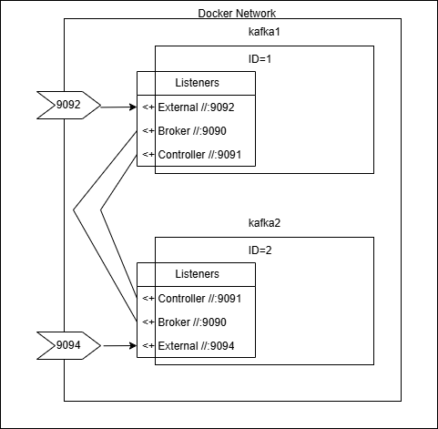

# [←](./../README.md) <a id="home"></a> Kafka

## Table of Contents:
- [Kafka with Docker Compose](#compose)

----

## [↑](#home) <a id="compose"></a> Kafka with Docker Compose
Kafka Cluster удобно запускать при помощи Docker Compose.\
Это позволяет описать Docker Cluster в декларативном виде и запускать его всего одной командой.

Для начала, нам понадобится файлик, куда можно вынести меняющиеся настройки.\
Создадим файл ``env.env`` (или с любым другим названием) и отредактируем его содержимое:
> HOSTNAME=34.168.153.211

В качестве IP адреса укажем тот адрес, по которому хост доступен из вне и по которому к нему будут подключаться. Например, для Google Cloud VM это будет **"External IP"**.

Далее создадим файл ``docker-compose.yml``. Это название compose файла по умолчанию. Это позволяет не указывать явно через параметры какой файл нужно будет выполнять в команде ``docker compose``.

В файле опишем первую ноду (первого брокера) в нашем кластере:
```yml
services:
  kafka1:
    image: bitnami/kafka:latest
    container_name: kafka1
    ports:
      - "9092:9092"
    env-file:
      - env.env
    environment:
      - KAFKA_HEAP_OPTS=-Xmx512m -Xms256m
      - KAFKA_KRAFT_CLUSTER_ID=YflrbJQeT9KwMUANDUjqeA
      - KAFKA_CFG_NODE_ID=1
      - KAFKA_CFG_PROCESS_ROLES=controller,broker
      - KAFKA_CFG_CONTROLLER_LISTENER_NAMES=CONTROLLER
      - KAFKA_CFG_INTER_BROKER_LISTENER_NAME=BROKER
      - KAFKA_CFG_LISTENERS=BROKER://:9090,CONTROLLER://:9091,EXTERNAL://:9092
      - KAFKA_CFG_LISTENER_SECURITY_PROTOCOL_MAP=CONTROLLER:PLAINTEXT,BROKER:PLAINTEXT,EXTERNAL:PLAINTEXT
      - KAFKA_CFG_ADVERTISED_LISTENERS=BROKER://kafka1:9090,EXTERNAL://${HOSTNAME:-localhost}:9092
      - KAFKA_CFG_CONTROLLER_QUORUM_VOTERS=1@kafka1:9091,2@kafka2:9091,3@kafka3:9091
    volumes:
      - /kafka/broker-1:/bitnami/kafka
```

Значение для ``KAFKA_KRAFT_CLUSTER_ID`` было сгенерировано при помощи скрипта ``kafka-storage`` входящего в Kafka. Для генерации необходимо выполнить скрипт (или его аналог в папке bin/windows):
>  bin/kafka-storage.sh random-uuid

Кроме того, т.к. это образ Kafka от Bitnami необходимо учитывать некоторые особенности.\
Про них можно прочитать в репозитории Bitnami: **"[Persisting your data](https://github.com/bitnami/containers/blob/main/bitnami%2Fkafka%2FREADME.md#persisting-your-data)"**.

Если этого не сделать, то можно столкнуться с **"[permissions issue](https://github.com/bitnami/containers/issues/37205)"**. Для её решения нужно (в нашем случае для каталога /kafka/broker-1):
```
sudo mkdir /kafka/broker-1
sudo chown 1001:1001 /kafka/broker-1
```

В случае работы на Google Cloud нужно не забыть открыть доступ к порту в ``Firewall Rules``.\
В меню Google Cloud нужно выбрать **"VPC Network"** и перейти в подраздел **"Filewall"**.\
Например, для диапазона ``0.0.0.0/0`` и диапазона портов ``tcp:9090-9099`` можно разрешить ``ingress``. В том числе можно правила применять на основе **"[Google Cloud Network Tags](https://cloud.google.com/vpc/docs/add-remove-network-tags)"**.

Чтобы запустить Kafka Cluster необходимо выполнить команду:
> docker compose --env-file env.env up

Прежде чем запустить кластер наполним его нодами согласно данным кворума, описанным в ``KAFKA_CFG_CONTROLLER_QUORUM_VOTERS``. Согласно этой настройке мы ожидаем кворум из трёх нод. Создадим ещё два сервиса по образу и подобию сервиса ``kafka1``.

У каждой ноды должен быть уникальный ``KAFKA_CFG_NODE_ID``.

Т.к. все брокеры будут доступны по одному IP адресу, для подключения из вне у них должны быть разные порты. Для этого для конфигурации ``EXTERNAL`` сервисы должны быть доступны по разным портам. Например, по портам 9092, 9094 и 9096. Данный факт нужно отразить в ``KAFKA_CFG_LISTENERS``, а так же в ``KAFKA_CFG_ADVERTISED_LISTENERS``.

Кроме того, не забудем каждой ноде присвоить собственный каталог **volumes** и не забудем выполнить ``sudo chown 1001:1001`` для этого каталога.

Чтобы понять, почему именно так настроены поля, рассмотрим небольшую визуализацию:

